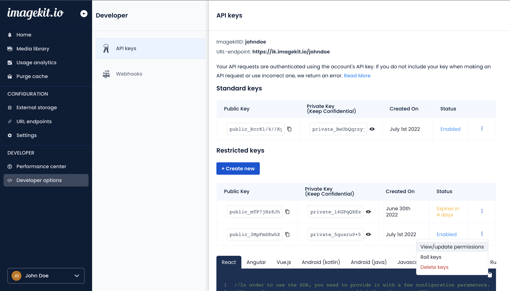
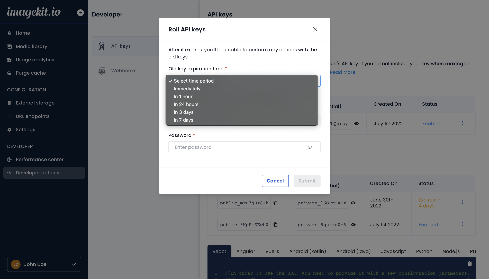

# API keys

ImageKit [authenticates](authentication.md) your API requests using your account's API keys. If you don't include your key when making an API request or use an incorrect or outdated one, we return an error.

You can use API keys to authenticate requests to [these API endpoints](README.md).


**API key limits**\

- You can only have five active API key pairs at once.
- Your account will always have at least one active pair of standard API keys.
  

## Types of keys

- Standard keys: A standard API key has read and write access to all the APIs listed above.
- Restricted key: A restricted API key allows only the minimum [level of access](#resource-list) that you specify across all the APIs listed above. The three access levels are: `None`, `Read only`, and `Read and write`. For example, if you set `Read only` permission for media access for your restricted key, you cannot use it to perform any upload, update, or delete operation. You can only perform operations like list and search files, get file details, get file metadata, etc.

## Obtaining your API keys

[View](https://imagekit.io/dashboard/developer/api-keys) your API keys in the ImageKit.io dashboard in the **API keys** section under the **Developer options** tab. Every account has one pair of standard public and private keys by default.

### **Public key**

This is used to identify your account in certain client-side file upload implementations. It is not meant to be secret, and you can publish this in client-side Javascript code, or an Android or iPhone app.

### **Private key**

This should be kept confidential and only stored on your servers. A private key is used to [authenticate](authentication.md) your account when you make an API request.

## Keeping your keys safe

It is strongly recommended to keep your private key safe and confidential. To help keep your API keys secure, follow these best practices:

1. Do not embed API keys directly in your code. API keys that are embedded in code can be accidentally exposed to the public. For example, you may forget to remove the keys from the code that you share. Instead of embedding your API keys in your applications, store them in environment variables or in files outside of your application's source tree.
2. Do not store API keys in files inside your application's source tree. If you store API keys in files, keep the files outside your application's source tree to help ensure your keys do not end up in your source code control system. This is particularly important if you use a public source code management system such as GitHub.

## Rolling keys

If an API key is compromised, you should roll that pair immediately and start using the newly generated keys. The newly generated pair has the same resource access permissions as the old one.

You can choose when to expire the existing key:

- Immediately
- In 1 hour
- In 24 hours
- In 3 days
- In 7 days

The expiry period you choose blocks and expires the existing key after the time period you specify. Regardless of the expiry period, you can use the new key immediately.

## Deleting keys

You can delete any existing API key in your account. However, your account will always have at least one pair of active standard keys.

## Revealing keys

By default, the private key is masked for security reasons. You can click on the reveal icon next to the private key and enter your password to authorize and reveal the private keys.

## Restricted API keys

You can:

- Create a new restricted API key and specify its resource access permissions.
- Update resource access permissions on any existing restricted API keys.

The three access levels across any resource are: `None`, `Read only`, and `Read and write`.

### Resource list

- Media access: Permissions for operations on Upload, Media management, File metadata, and Custom metadata management APIs.

| Permission level   | APIs                                                                                                                                                                                                                                                                                                                                                                                                                                                                                                                                                                                                                                                                                                                                                                                                                                                                                                                                                                                                                                                                                                                                                                                                                                                                                                            |
| ------------------ | --------------------------------------------------------------------------------------------------------------------------------------------------------------------------------------------------------------------------------------------------------------------------------------------------------------------------------------------------------------------------------------------------------------------------------------------------------------------------------------------------------------------------------------------------------------------------------------------------------------------------------------------------------------------------------------------------------------------------------------------------------------------------------------------------------------------------------------------------------------------------------------------------------------------------------------------------------------------------------------------------------------------------------------------------------------------------------------------------------------------------------------------------------------------------------------------------------------------------------------------------------------------------------------------------------------- |
| **None**           | No APIs                                                                                                                                                                                                                                                                                                                                                                                                                                                                                                                                                                                                                                                                                                                                                                                                                                                                                                                                                                                                                                                                                                                                                                                                                                                                                                         |
| **Read**           | [List and search files](../media-api/list-and-search-files.md)   [Get file details](../media-api/get-file-details.md)   [Get file version details](../media-api/get-file-version-details.md)   [Get file versions](../media-api/get-file-versions.md)   [Bulk job status](../media-api/copy-move-folder-status.md)   [Purge cache status](../media-api/purge-cache-status.md)   [Get image metadata for uploaded media files](../metadata-api/get-image-metadata-for-uploaded-media-files.md)   [Get image metadata from remote URL](../metadata-api/get-image-metadata-from-remote-url.md)   [Get custom metadata field](../custom-metadata-fields-api/get-custom-metadata-field.md)                                                                                                                                                                                                                                                                                                                                                                                                                                                                                                                                                                                           |
| **Read and write** | All APIs under read permission   [Server side file upload](../upload-file-api/server-side-file-upload.md)   [Client side file upload](../upload-file-api/client-side-file-upload.md)   [Secure client side file upload](../upload-file-api/secure-client-side-file-upload.md)     [Update file details](../media-api/update-file-details.md)   [Add tags (bulk)](../media-api/add-tags-bulk.md)  [Remove tags (bulk)](../media-api/remove-tags-bulk.md)  [Remove AITags (bulk)](../media-api/remove-aitags-bulk.md)  [Delete file](../media-api/delete-file.md)   [Delete file version](../media-api/delete-file-version.md)  [Delete files (bulk)](../media-api/delete-files-bulk.md) [Copy file](../media-api/copy-file.md) [Move file](../media-api/move-file.md) [Rename file](../media-api/rename-file.md) [Restore file version](../media-api/restore-file-version.md) [Create folder](../media-api/create-folder.md) [Delete folder](../media-api/delete-folder.md) [Copy folder](../media-api/copy-folder.md) [Move folder](../media-api/move-folder.md) [Purge cache](../media-api/purge-cache.md)  [Create custom metadata field](../custom-metadata-fields-api/create-custom-metadata-field.md)  [Update custom metadata field](../custom-metadata-fields-api/update-custom-metadata-field.md)  [Delete custom metadata field](../custom-metadata-fields-api/delete-custom-metadata-field.md) |
